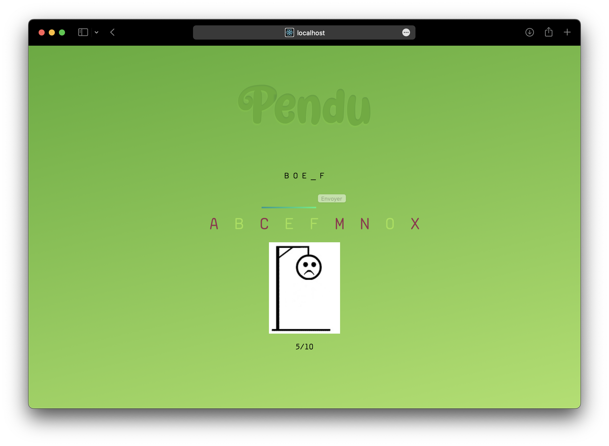

# Pendu



This project was created to learn react with some fun stuff

## How to start the app

In the project directory, you can run:

```
yarn start
```

Then go to `http://localhost:3000/`

## How to build

```
yarn build
```

Then go to you can launch `./build/index.html`
